<div align="center">

[](https://swarmdo.com)

[](https://github.com/SwarmDo/swarmdo/releases)
[](https://github.com/SwarmDo/swarmdo/blob/main/LICENSE)
[](https://swarmdo.com)
[](https://github.com/SwarmDo/swarmdo)
[](https://buymeacoffee.com/swarmdo)

*Based on the original, hugely popular **ruflo** — renamed, self-contained, and MIT-licensed. Full lineage in [NOTICE](NOTICE).*

# Swarmdo

**An agent meta-harness for Claude Code and Codex.**

</div>

> **Agent = Model + Harness.** The model writes; the harness gives it tools, memory, loops, sandboxes, and controls so it can actually work. **Swarmdo is the harness** — the execution layer around Claude Code and Codex that adds 100+ specialized agents, coordinated swarms, self-learning memory, federated comms across machines, and enterprise security guardrails. So agents don't just run, they collaborate.

One `npx swarmdo init` gives Claude Code a nervous system: agents self-organize into swarms, learn from every task, remember across sessions, and — with federation — securely talk to agents on other machines without leaking data. You keep writing code. Swarmdo handles the coordination.

```
Self-Learning / Self-Optimizing Agent Architecture

User --> Swarmdo (CLI/MCP) --> Router --> Swarm --> Agents --> Memory --> LLM Providers
                          ^                           |
                          +---- Learning Loop <-------+
```

> **New to Swarmdo?** You don't need to learn 314 MCP tools or 26 CLI commands. After `init`, just use Claude Code normally — the hooks system automatically routes tasks, learns from successful patterns, and coordinates agents in the background.

<details>
<summary><strong>📖 Background — where the name comes from</strong></summary>

> Swarmdo is now Swarmdo — named by [`the upstream author`](https://swarmdo.com), who loves Rust, flow states, and building things that feel inevitable. The "Ru" is the the upstream author. The "flo" is working until 3am. Underneath, powered by [`Cognitum.One`](https://cognitum.one/?Swarmdo) agentic architecture, running a supercharged Rust-based AI engine, embeddings, memory, and plugin system.

</details>

---



## Quick Start

There are **two different install paths** with very different surface areas. Pick based on what you need (#1744):

| | **Claude Code Plugin** | **CLI install (`npx swarmdo init`)** |
|---|---|---|
| What it gives you | Slash commands + skills + agent definitions per-plugin; `swarmdo-core` also registers the swarmdo MCP server | Full Swarmdo loop — 98 agents, 60+ commands, 30 skills, MCP server, hooks, daemon |
| Files in your workspace | **Zero** | `.claude/`, `.swarmdo/`, `CLAUDE.md`, helpers, settings |
| MCP server registered | **Yes with `swarmdo-core`** (via the plugin's `.mcp.json`); other plugins are commands/skills only | Yes |
| Hooks installed | No | Yes |
| Best for | Try Swarmdo without committing files to your workspace | Production use — everything works as documented |

### Path A — Claude Code Plugins (zero files in your repo)

```bash
# Add the marketplace
/plugin marketplace add SwarmDo/swarmdo

# Install core + any plugins you need
/plugin install swarmdo-core@swarmdo
/plugin install swarmdo-swarm@swarmdo
/plugin install swarmdo-rag-memory@swarmdo
/plugin install swarmdo-neural-trader@swarmdo
```

`swarmdo-core` registers the swarmdo MCP server (300+ tools) plus base agents and setup skills; the other plugins add their slash commands and agent definitions. Hooks and the daemon still require Path B.

> 📦 `swarmdo-core` has been submitted to Anthropic's Claude Code plugin directory (community marketplace). Once approved it will also be installable via `/plugin install swarmdo-core@claude-community` — no marketplace-add needed.

<details>
<summary><strong>🔌 All 35 plugins</strong></summary>

#### Core & Orchestration

| Plugin | What it does |
|--------|-------------|
| [**swarmdo-core**](plugins/swarmdo-core/README.md) | Foundation — server, health checks, plugin discovery |
| [**swarmdo-swarm**](plugins/swarmdo-swarm/README.md) | Coordinate multiple agents as a team |
| [**swarmdo-autopilot**](plugins/swarmdo-autopilot/README.md) | Let agents run autonomously in a loop |
| [**swarmdo-loop-workers**](plugins/swarmdo-loop-workers/README.md) | Schedule background tasks on a timer |
| [**swarmdo-workflows**](plugins/swarmdo-workflows/README.md) | Reusable multi-step task templates |
| [**swarmdo-federation**](plugins/swarmdo-federation/README.md) | Agents on different machines collaborate securely |

#### Memory & Knowledge

| Plugin | What it does |
|--------|-------------|
| [**swarmdo-agentdb**](plugins/swarmdo-agentdb/README.md) | Fast vector database for agent memory |
| [**swarmdo-rag-memory**](plugins/swarmdo-rag-memory/README.md) | Smart retrieval — hybrid search, graph hops, diversity ranking |
| [**swarmdo-rvf**](plugins/swarmdo-rvf/README.md) | Save and restore agent memory across sessions |
| [**swarmdo-swarmvector**](plugins/swarmdo-swarmvector/README.md) | `swarmvector` (vendored in-repo at `v3/vendor/swarmvector`) — GPU-accelerated search, Graph RAG, 103 tools |
| [**swarmdo-knowledge-graph**](plugins/swarmdo-knowledge-graph/README.md) | Build and traverse entity relationship maps |

#### Intelligence & Learning

| Plugin | What it does |
|--------|-------------|
| [**swarmdo-intelligence**](plugins/swarmdo-intelligence/README.md) | Agents learn from past successes and get smarter |
| [**swarmdo-graph-intelligence**](plugins/swarmdo-graph-intelligence/) | Sublinear graph reasoning — PageRank, delta updates, complexity-aware execution (ADR-123) |
| [**swarmdo-daa**](plugins/swarmdo-daa/README.md) | Dynamic agent behavior and cognitive patterns |
| [**swarmdo-swarmllm**](plugins/swarmdo-swarmllm/README.md) | Run local LLMs (Ollama, etc.) with smart routing |
| [**swarmdo-goals**](plugins/swarmdo-goals/README.md) | Break big goals into plans and track progress |

#### Code Quality & Testing

| Plugin | What it does |
|--------|-------------|
| [**swarmdo-testgen**](plugins/swarmdo-testgen/README.md) | Find missing tests and generate them automatically |
| [**swarmdo-browser**](plugins/swarmdo-browser/README.md) | Automate browser testing with Playwright |
| [**swarmdo-jujutsu**](plugins/swarmdo-jujutsu/README.md) | Analyze git diffs, score risk, suggest reviewers |
| [**swarmdo-docs**](plugins/swarmdo-docs/README.md) | Generate and maintain documentation automatically |

#### Security & Compliance

| Plugin | What it does |
|--------|-------------|
| [**swarmdo-security-audit**](plugins/swarmdo-security-audit/README.md) | Scan for vulnerabilities and CVEs |
| [**swarmdo-aidefence**](plugins/swarmdo-aidefence/README.md) | Block prompt injection, detect PII, safety scanning |

#### Architecture & Methodology

| Plugin | What it does |
|--------|-------------|
| [**swarmdo-adr**](plugins/swarmdo-adr/README.md) | Track architecture decisions with a living record |
| [**swarmdo-ddd**](plugins/swarmdo-ddd/README.md) | Scaffold domain-driven design — contexts, aggregates, events |
| [**swarmdo-sparc**](plugins/swarmdo-sparc/README.md) | Guided 5-phase development methodology with quality gates |
| [**swarmdo-metaharness**](plugins/swarmdo-metaharness/README.md) | Grade your agent setup, scan tool configs for security risks, and track changes over time ([guide](docs/metaharness-user-guide.md)) |
| [**swarmdo-arena**](plugins/swarmdo-arena/README.md) | Competitive ruliology — pit agent strategies against each other in tournaments, hill-climb and co-evolve the winners (ADR-147/148) |

#### DevOps & Observability

| Plugin | What it does |
|--------|-------------|
| [**swarmdo-migrations**](plugins/swarmdo-migrations/README.md) | Manage database schema changes safely |
| [**swarmdo-observability**](plugins/swarmdo-observability/README.md) | Structured logs, traces, and metrics in one place |
| [**swarmdo-cost-tracker**](plugins/swarmdo-cost-tracker/README.md) | Track token usage, set budgets, get cost alerts |

#### Extensibility

| Plugin | What it does |
|--------|-------------|
| [**swarmdo-agent**](plugins/swarmdo-agent/README.md) | Run agents — local WASM sandbox (rvagent) + Anthropic Claude Managed Agents (cloud) |
| [**swarmdo-plugin-creator**](plugins/swarmdo-plugin-creator/README.md) | Scaffold, validate, and publish your own plugins |

#### Domain-Specific

| Plugin | What it does |
|--------|-------------|
| [**swarmdo-iot-cognitum**](plugins/swarmdo-iot-cognitum/README.md) | IoT device management — trust scoring, anomaly detection, fleets |
| [**swarmdo-neural-trader**](plugins/swarmdo-neural-trader/README.md) | [`neural-trader`](https://npmjs.com/package/neural-trader) — AI trading with 4 agents, backtesting, 112+ tools |
| [**swarmdo-market-data**](plugins/swarmdo-market-data/README.md) | Ingest market data, vectorize OHLCV, detect patterns |

</details>

### CLI Install

**macOS / Linux / WSL / Git-Bash:**

```bash
# One-line install (POSIX shells only — see Windows note below)
curl -fsSL https://cdn.jsdelivr.net/gh/SwarmDo/swarmdo@main/scripts/install.sh | bash
```

**All platforms (including native Windows PowerShell / cmd):**

```bash
# Interactive setup wizard — runs identically on every platform
npx swarmdo@latest init wizard

# Compress a memory file to save tokens (caveman mode — e2e-verified 33% smaller, backup kept)
npx swarmdo compress CLAUDE.md
npx swarmdo compress notes.md --check   # token-free: just report compressibility

# Quick non-interactive init
# npx swarmdo@latest init

# Or install globally
npm install -g swarmdo@latest
```

> 💡 **Windows users:** the `curl ... | bash` form needs a POSIX shell (Git-Bash, WSL, MSYS). The `npx swarmdo@latest init wizard` line works natively in PowerShell and cmd. If you hit an `'bash' is not recognized` error, use the `npx` line instead — both end up running the same init flow.

### MCP Server

```bash
# Add Swarmdo as an MCP server in Claude Code (canonical form, matches USERGUIDE.md)
claude mcp add swarmdo -- npx swarmdo@latest mcp start
```

---

## One Namespace: `/sDo`

Since v1.4.0 every slash surface swarmdo installs is namespaced, so the whole toolkit groups together in Claude Code's `/` menu instead of scattering between built-ins — type `/sDo` and it all surfaces:

```
/sDo:swarmdo-help        /sDo:swarm:swarm-init     /sDo:sparc:architect
/sdo-caveman-compress    /sdo-ponytail             /sdo-agentdb-vector-search
```

Commands use the `sDo:` namespace (`.claude/commands/sDo/…`); skills use the `sdo-` prefix (skill names must be lowercase). Upgrades migrate automatically — `swarmdo init` and `swarmdo efficiency on` remove pre-1.4.0 unprefixed copies so no duplicate menu entries linger.

---

## Efficiency: Caveman & Ponytail, Built In

Two of the most-loved Claude Code skills ship inside swarmdo as first-class features — vendored MIT forks with attribution in [NOTICE](NOTICE), integrated across the CLI, the agents, and the init wizard.

### 🪨 Caveman compression

Memory files (CLAUDE.md, notes, todos) get re-read every session — and they're written for humans, not token budgets. Caveman rewrites them in few-token caveman-speak with substance, code, and URLs preserved and the original backed up. E2E-verified: 33% smaller with every technical fact intact.

```bash
# Inside Claude Code
/sdo-caveman-compress CLAUDE.md

# From any terminal — no Claude Code session needed
swarmdo compress CLAUDE.md
swarmdo compress notes.md --check     # token-free dry run: reports type + compressibility
```

### 💤 Ponytail mode

The laziest senior dev in the room, on demand: YAGNI, standard library before dependencies, one line before fifty, no speculative abstraction. Three intensities plus audit/review/debt lenses.

```bash
# Inside Claude Code
/sdo-ponytail            # lite | full | ultra

# For spawned agents — per call:
#   agent_run / agent_execute with ponytail: true
# or globally:
export SWARMDO_PONYTAIL=1            # explicit ponytail:false always wins
```

### Toggling

Everything is opt-in and reversible — skills are user-invoked, so "on" means *available*, never *automatic*.

| Layer | Toggle |
|-------|--------|
| This project | `swarmdo efficiency on\|off\|status` |
| At init | wizard "Efficiency" skill group |
| Per agent | `ponytail: true/false` on the spawn call |
| Globally | `SWARMDO_PONYTAIL=1` env |

Credits: [caveman](https://github.com/JuliusBrussee/caveman) by Julius Brussee · [ponytail](https://github.com/DietrichGebert/ponytail) by Dietrich Gebert (both MIT).

## What You Get

| Capability | Description |
|------------|-------------|
| 🤖 **100+ Agents** | Specialized agents for coding, testing, security, docs, architecture |
| 📡 **Comms Layer** | Zero-trust federation — agents across machines/orgs discover, authenticate, and exchange work securely |
| 🐝 **Swarm Coordination** | Hierarchical, mesh, and adaptive topologies with consensus |
| 🧠 **Self-Learning** | SONA neural patterns, ReasoningBank, trajectory learning |
| 💾 **Vector Memory** | HNSW-indexed AgentDB — measured ~1.9x faster at N=20k, ~3.2x–4.7x at N=5k vs brute force (recall@10 ~0.99); ANN wins above the crossover, ties/loses at small N. See [audit](docs/reviews/intelligence-system-audit-2026-05-29.md) + [`scripts/benchmark-intelligence.mjs`](scripts/benchmark-intelligence.mjs) |
| ⚡ **Background Workers** | 12 auto-triggered workers (audit, optimize, testgaps, etc.) |
| 🧩 **Plugin Marketplace** | 33 native Claude Code plugins + 21 npm plugins |
| 🔌 **Multi-Provider** | Claude, GPT, Gemini, Cohere, Ollama with smart routing |
| 🛡️ **Security** | AIDefence, input validation, CVE remediation, path traversal prevention |
| 🌐 **Agent Federation** | Cross-installation agent collaboration with zero-trust security |
| 🔬 **[MetaHarness](docs/metaharness-user-guide.md)** | Audit your AI agent setup before you ship. Grade readiness (1-100), scan tool configs for security issues, snapshot the whole project to catch regressions over time, and find templates that match your repo. `swarmdo eject` turns a swarmdo project into a standalone agent toolkit with its own name. [Full guide](docs/metaharness-user-guide.md). |

### 🧰 The Operational Toolkit (v1.3 → v1.4)

The recent release train added a full day-to-day operations layer around the swarm — spend, safety, releases, and memory portability:

| Command | What it does |
|---------|-------------|
| `swarmdo usage` (alias `cost`) | Claude Code **spend analytics** from your local transcripts — `daily`, `weekly`, `monthly` (with a month-end spend projection), `models`, `projects`, `sessions`, live 5-hour `blocks` burn, `errors` (tool-failure analytics), `cache` (prompt-cache efficiency + $ saved), `diff` (period-over-period comparison with per-model movers), `reflect` (a wrapped-style retrospective — busiest day, streak, top models/projects, peak hour, delegation ratio — with a shareable `--html` dashboard), and `limits` (an official-quota **exhaustion forecaster** over Claude Code's `rate_limits`); the standard views take `--csv` for spreadsheet export |
| `swarmdo usage guard` | **Budget policy** — limits for the active 5h block / today / month via flags or `SWARMDO_GUARD_*` env → ok / warn / over; `--strict` exits 1, safe for CI gates and Stop hooks |
| `swarmdo hud` | **One-screen ops HUD** — 5h block burn, task readiness, daemon workers, memory snapshots (`--watch`, `--json`) |
| `swarmdo repair` (alias `tdd-repair`) | **Test-Driven Repair** — a bounded, budget-capped headless `claude` loop that fixes source until a failing test passes; dry-run unless `--confirm` |
| `swarmdo task … --dependencies` | **Task dependency DAG** — `task ready` lists unblocked work, `task graph` renders the graph, the dispatcher gates on readiness; `task parse-prd <spec.md>` decomposes a PRD straight into the DAG; `task doctor` (alias `health`) separates a transient wait from a **permanent stall** — a task whose prerequisite failed/was cancelled/is missing will never run — and flags whole-graph **deadlock**, `--ci` so a dispatch loop can't spin forever (Airflow `upstream_failed` semantics) |
| `swarmdo worktree` (alias `wt`) | **Parallel-agent isolation** on git worktrees — add / list / diff / merge / remove |
| `swarmdo transcript` (alias `tx`) | **Export any Claude Code session** to clean markdown — system noise stripped, ready to share; `transcript search <query>` full-text-searches every session |
| `swarmdo compact` | **Compress noisy command output** before it reaches an LLM — strip ANSI, collapse repeats, fold `node_modules` stack frames, window long logs. `npm test 2>&1 \| swarmdo compact` or `swarmdo compact -- npm test` (exit code propagates). Deterministic, zero tokens |
| `swarmdo codegraph` (alias `cg`) | **Queryable symbol index** — `codegraph index` scans TS/JS for exported symbols; `query <name>` (with `--fuzzy`/`--kind`) and `file <path>` answer "where is X defined / what does this file export" from `.swarm/codegraph.json` instead of grep+read round-trips. `codegraph importers <file>` shows reverse deps ("what breaks if I change this"); `codegraph imports <file>` shows a file's dependencies. 1,786 symbols + import graph across 296 files in <1s. Also MCP tools (`codegraph_query`/`file`/`imports`/`importers`/`index`/`stats`) so agents query the graph in-session |
| `swarmdo redact` | **Mask secrets before they reach an LLM/log/memory** — detect API keys, tokens, and private keys (gitleaks-style rule catalog + Shannon-entropy fallback) and redact them. Stdin filter (`cat deploy.log \| swarmdo redact`), command-wrap (`swarmdo redact -- npm run deploy`), or `--scan` to fail CI on any secret — `--scan --sarif` emits a **SARIF 2.1.0** report so leaked secrets surface as GitHub code-scanning alerts + PR annotations. Also MCP tools (`redact_text`/`redact_scan`). Deterministic, zero tokens |
| `swarmdo pack` | **Bundle a repo into one AI-context blob** — walk the tree (respects `.gitignore` + glob `--include`/`--exclude`, skips binaries/node_modules), emit markdown/xml/json/plain with a directory tree and per-file + total token estimates. `swarmdo pack --tokens` for a budget breakdown; `--redact` masks secrets first. Deterministic |
| `swarmdo env` | **Catch env-var drift before deploy** — statically scan code for `process.env.X` / `import.meta.env.X` / `Deno.env.get` / `os.getenv` references and reconcile against `.env` and `.env.example`: reports **missing** (used but undeclared), **unused**, and **undocumented**. `--ci` exits 1 on missing vars. Also an MCP tool (`env_check`). Deterministic |
| `swarmdo license` | **Audit dependency licenses** — walk `node_modules`, resolve each package's SPDX license, and gate on an allow/deny policy so a GPL or unknown license can't slip into a permissive tree. `--allow MIT,Apache-2.0 --ci` fails the build; distinct from `security` (CVEs). Also an MCP tool (`license_check`). Deterministic |
| `swarmdo sbom` | **Software Bill of Materials from the lockfile** — emit a CycloneDX (default) or SPDX JSON manifest of every dependency with version, purl, license, and integrity hash, for compliance/vuln tooling. `--spec spdx`, `-o sbom.json`, `--production`. Completes the env/license/sbom supply-chain trio. Deterministic |
| `swarmdo apply` | **A forgiving `git apply`** — apply a unified diff with fuzzy context matching, so an agent's patch lands even when line numbers have drifted or a context line is slightly off, and reports exactly which hunks couldn't. `--dry-run` to preview, `--fuzz N` to tolerate more drift. Also an MCP tool (`apply_patch`). Deterministic |
| `swarmdo hotspots` | **Change-risk hotspots from git history** — rank files by churn × recency × author-spread to surface the technical debt worth refactoring or testing, answered from data instead of a guess. `--since 90d`, `--by risk\|churn\|commits\|authors`, `--top N`, `--format json`. Pairs with `codegraph`; also an MCP tool (`hotspots`). Deterministic |
| `swarmdo affected` | **Run only the tests your change touches** — from a git diff, walk `codegraph`'s import graph to list every file (and test file) a change could break (reverse-dependency closure, nx/turbo/`jest --findRelatedTests` style). `--base main`, `--tests` (pipeable list), `--format json`. Also an MCP tool (`affected`). Deterministic |
| `swarmdo cycles` | **Find circular import dependencies** — an SCC scan over `codegraph`'s import graph surfaces the mutually-importing file groups (and self-imports) that cause temporal-dead-zone and `undefined`-export bugs, `madge --circular` style. `--ci` exits 1 on any cycle to gate a build; `--format json`. Also an MCP tool (`cycles`). Deterministic |
| `swarmdo coupling` | **Files that change together** — the empirical complement to `affected`'s static import graph: mine git history for file pairs that keep landing in the same commit (a schema and its type, a serializer split across modules) so you catch the co-edit you'd otherwise forget. `--file <path>` answers "what changes with X?", `--since`, `--min-shared`, `--csv`. Modeled on code-maat / CodeScene. Also an MCP tool (`coupling`). Deterministic |
| `swarmdo ownership` | **Who owns each file, and what breaks if they leave** — a per-file knowledge map + bus factor from git history: the dominant author, ownership concentration, and the fewest authors whose churn clears 50% (a lone owner is flagged ⚠ key-person), plus a repo-wide truck factor. `--since`, `--min-churn`, `--top`, `--csv`, `--format json`. code-maat main-dev / CodeScene "Knowledge Map"; also an MCP tool (`ownership`). Deterministic |
| `swarmdo hidden-coupling` | **Co-change with no import edge** — join the two graphs swarmdo already owns (temporal `coupling` from git + `codegraph`'s import graph) and emit the set difference: file pairs that keep changing together yet nothing in the code links them ("logical minus structural coupling" — a config and its consumers, a schema and its mirror type). The co-edit `affected` can't see. `--since`, `--min-shared`, `--csv`, `--format json`. Grounded in Gall et al. (ICSM 1998). Deterministic |
| `swarmdo testreport` | **JUnit/TAP → failure digest** — turn raw test-result files into the exact failing test names + `file:line` + assertion messages, instead of scanning hundreds of log lines. The front-half of the test→fix loop: feed the failures straight into `repair`. Reads a file, a directory, or stdin; `--ci` exits 1 on any failure, `--format json`. Also an MCP tool (`testreport`). Deterministic |
| `swarmdo integrations` (alias `integrate`) | **Use swarmdo from Codex CLI, GitHub Copilot CLI, and pi** — one command wires AGENTS.md + each CLI's MCP config (idempotent, dry-run first, never touches your Claude Code setup) |
| OpenRouter model pool | **Let swarms pick from any models you configure** — declare tier-mapped OpenRouter models in `swarmdo.config.json`; the router Thompson-samples among them per task and the execution layer dispatches the winner |
| `swarmdo changelog` (alias `notes`) | **Release notes from conventional commits** — `--out NOTES.md` feeds `gh release create --notes-file`; `--contributors` appends a credited contributor roll |
| `swarmdo mcp doctor` | **MCP config diagnosis** — missing binaries, bad URLs, malformed entries across `.mcp.json` + `~/.claude.json` |
| `swarmdo config lint` | **Static config validation** — the pure shape layer for `swarmdo.config.json`, the `.claude/settings*.json` hooks block, `.mcp.json`, **`.claude/agents/*.md` subagents** (missing `name`/`description`, a `name` duplicated across files — CC silently loads only one — a bad `model`, malformed frontmatter), and **custom slash commands + skills** (malformed YAML that makes CC load empty metadata, a bad `effort`, an inline `` !`cmd` `` bash-injection that's inert or not covered by `allowed-tools`). `--strict` gates CI |
| `swarmdo permissions` (alias `perms`) | **Audit your Claude Code permission rules** — static analysis of `permissions.allow`/`deny`/`ask` in `.claude/settings*.json`: flags allow↔deny conflicts (dead rules), over-broad `Bash(*)` grants, shadowed/redundant rules, duplicates, and malformed entries. `--strict` gates CI. Read-only; the static-safety sibling of `config lint` / `mcp doctor` |
| `swarmdo comms` (alias `mailbox`) | **Cross-session agent mailbox** — one Claude Code session messages another by name (`send -t <session>`, `-t all` broadcasts, `inbox`, `read`, `watch`); sessions on the same repo share `.swarmdo/comms/`. `inbox --hook` surfaces new mail as prompt context without polling. Also MCP tools (`comms_send`/`comms_inbox`) |
| `swarmdo hooks memory-inject` | **Prompt-time semantic memory injection** — embeds each prompt, vector-searches your stored memories, and injects the most relevant under a token budget (recall at the moment of need); wire it with `hooks recipe memory-inject` |
| `swarmdo hooks notify -d` | **Desktop notifications** — OS-native toast (macOS `osascript`, Linux `notify-send`) |
| `swarmdo hooks recipe` | **One-command Claude Code hooks** — install `notify-done`/`notify-input` (desktop pings), `memory-inject` (relevant memories each prompt), `comms-inbox` (new mail as context), or `command-guard` (a PreToolUse deny hook that blocks dangerous bash — `rm -rf /`, pipe-to-shell, force-push to main — the net swarmdo needs when running headless); dry-run by default, idempotent merge that never clobbers your settings |
| `swarmdo preset` + `init --preset` | **5-tier capability ladder** — `minimal` → `basic`★ → `standard` → `advanced` → `max`; one word instead of dozens of flags |
| `swarmdo memory export/import -f obsidian` | **Obsidian vault roundtrip** — DB → markdown notes (YAML frontmatter, `[[wikilinks]]` stay live) → edit in Obsidian → sync back, re-embedded; `import --watch` keeps the vault live-synced as you edit |
| `swarmdo memory backup` / `revectorize` | WAL-safe nightly DB snapshots · repair hash-era vectors |

```bash
swarmdo usage blocks                   # 5h windows, live burn on the active one
swarmdo usage guard --block-usd 5 --daily-usd 20 --strict
swarmdo changelog --version v1.4.4 --out NOTES.md
swarmdo hooks recipe notify-done --apply
swarmdo memory export -o ./vault -f obsidian && open ./vault
```

<p align="center">
  </a>
</p>


**Swarmdo's web UI is a multi-model AI chat with built-in Model Context Protocol (MCP) tool calling.** Talk to Qwen, Claude, Gemini, or OpenAI while Swarmdo invokes the same MCP tools the CLI uses — agent orchestration, persistent memory, swarm coordination, code review, GitHub ops — directly from chat. No install, no API key needed to try it.

| | What it is | Why it matters |
|---|------------|----------------|
| 🧠 | **Any model, local or remote** | 6 curated frontier models out-of-the-box — Qwen 3.6 Max (default), Claude Sonnet 4.6, Claude Haiku 4.5, Gemini 2.5 Pro, Gemini 2.5 Flash, OpenAI — via OpenRouter. Add your own: any OpenAI-compatible endpoint (vLLM, Ollama, LM Studio, Together, Groq, self-hosted). |
| 🦾 | **swarmLLM self-learning AI** | Native support for [swarmLLM](the upstream project (see NOTICE)) (lives in `upstream/SwarmVector/examples/swarmLLM`) — Swarmdo's self-improving local model layer. Routes to MicroLoRA adapters, learns from your trajectories via SONA, and stays on your machine. Pair with the cloud models or run fully offline. |
| 🛠️ | **~210 tools, ready to call** | 5 server groups (Core, Intelligence, Agents, Memory, DevTools) plus an 18-tool gallery that runs entirely in your browser — works offline. |
| 🔌 | **Bring your own MCP servers** | Click the **MCP (n)** pill in the chat input → *Add Server* and paste any MCP endpoint (HTTP, SSE, or stdio). Your tools join Swarmdo's native ones in the same parallel-execution flow. Run a local MCP server on `localhost:3000` and it just works. |
| ⚡ | **Tools run in parallel** | One model response can fire 4–6+ tools at the same time. The UI shows them as cards with a *Step 1 — 2 tools completed* badge so you can see exactly what ran. |
| 💾 | **Memory that sticks** | Say *"remember my favorite color is indigo"* and ask weeks later — Swarmdo recalls it. Backed by AgentDB + HNSW vector search (measured ~1.9x–4.7x faster than brute force above the crossover, recall@10 ~0.99). |
| 📘 | **Built-in capabilities tour** | Click the question-mark icon in the sidebar — a "Swarmdo Capabilities" modal opens with the full tool list, model strengths, architecture, and keyboard shortcuts. |
| 🚀 | **Zero install to try** | Open the hosted URL, pick a model, type a question. That's the whole onboarding. |


<p align="center">
  </a>
</p>


| | What it is | Why it matters |
|---|------------|----------------|
| 🎯 | **Plain-English goals** | Type *"ship the auth refactor with tests and a PR"* — Swarmdo extracts the success criteria, the constraints, and the implicit preconditions. No JSON, no DSL. |
| 🧭 | **GOAP A\* planner** | Classic gaming-AI planning ported to software work: state-space search through actions with preconditions/effects to find the shortest viable path. Replans on the fly when state changes. |
| 🌳 | **Visual plan tree** | Goals render as collapsible action trees with progress, blocked branches, and rollbacks highlighted. See *exactly* why an agent picked a path — no opaque chain-of-thought. |
| ♻️ | **Adaptive replanning** | When an action fails or new info arrives, the planner re-runs A\* from the current state instead of restarting. Failures become learning, not loops. |
| 🧠 | **Shared memory + SONA** | Plans, trajectories, and outcomes flow into AgentDB. Future plans retrieve past solutions via HNSW — the planner gets smarter with every run. |
| 🔗 | **Wired to MCP tools** | Every action node maps to a tool call (Swarmdo's ~210 MCP tools, your custom servers, or shell). The planner schedules them in parallel where the dependency graph allows. |


### Agent Federation — Slack for Agents

```
Your Agent --> [ Remove secrets ] --> [ Sign message ] --> [ Encrypted channel ]
                 Emails, SSNs,        Proves it came       No one reads it
                 keys stripped         from you              in transit
                                                                |
                                                                v
Their Agent <-- [ Block attacks ] <-- [ Check identity ] <------+
                 Stops prompt          Rejects forgeries
                 injection

                          Audit trail on both sides.
                  Trust builds over time. Bad behavior = instant downgrade.
```

Slack gave teams channels. Federation gives agents the same thing — **shared workspaces across trust boundaries**, where agents on different machines, orgs, or cloud regions can discover each other, prove who they are, and collaborate on tasks.

The difference: some channels are trusted, some aren't. [`@swarmdo/plugin-agent-federation`](the upstream project (see NOTICE)) handles that automatically. Your agents join a federation, get verified via mTLS + ed25519, and start exchanging work — with PII stripped before anything leaves your node and every message auditable. Untrusted agents can still participate at lower privilege: they see discovery info, not your memory. As they prove reliable, trust upgrades. If they misbehave, they get downgraded instantly — no human in the loop required.

You don't configure handshakes or manage certificates. You `federation init`, `federation join`, and your agents start talking. The protocol handles identity, the PII pipeline handles data safety, and the audit trail handles compliance.

> **📘 Full user guide:** [`docs/federation/`](./docs/federation/) — setup, MCP tools, trust levels, circuit breaker, and the (opt-in) WireGuard mesh layer that ties packet-layer reachability to federation trust. ADR-111 deep-dive at [`docs/federation/phase7-mesh-bringup.md`](./docs/federation/phase7-mesh-bringup.md).

<details>
<summary><strong>Federation capabilities</strong></summary>

| | Capability | How it works |
|---|---|---|
| 🔒 | **Zero-trust federation** | Remote agents start untrusted. Identity proven via mTLS + ed25519 challenge-response. No API keys, no shared secrets. |
| 🛡️ | **PII-gated data flow** | 14-type detection pipeline scans every outbound message. Per-trust-level policies: BLOCK, REDACT, HASH, or PASS. Adaptive calibration reduces false positives. |
| 📊 | **Behavioral trust scoring** | Formula (`0.4×success + 0.2×uptime + 0.2×threat + 0.2×integrity`) continuously evaluates peers. Upgrades require history; downgrades are instant. |
| 📋 | **Compliance built-in** | HIPAA, SOC2, GDPR audit trails as compliance modes. Every federation event produces a structured record searchable via HNSW. |
| 🤝 | **9 MCP tools + 10 CLI commands** | Full lifecycle: `federation_init`, `federation_send`, `federation_trust`, `federation_audit`, and more. |

</details>

<details>
<summary><strong>Example: two teams sharing fraud signals without sharing customer data</strong></summary>

```bash
# Team A: initialize federation and generate keypair
npx swarmdo@latest federation init

# Team A: join Team B's federation endpoint
npx swarmdo@latest federation join wss://team-b.example.com:8443

# Team A: send a task — PII is stripped automatically before it leaves
npx swarmdo@latest federation send --to team-b --type task-request \
  --message "Analyze transaction patterns for account anomalies"

# Team A: check peer trust levels and session health
npx swarmdo@latest federation status
```

</details>

See [issue #1669](the upstream project (see NOTICE)) for the complete architecture, trust model, and implementation roadmap.

```bash
# Claude Code plugin
/plugin install swarmdo-federation@swarmdo

# Or via CLI
npx swarmdo@latest plugins install @swarmdo/plugin-agent-federation
```

<details>
<summary><strong>Claude Code: With vs Without Swarmdo</strong></summary>

| Capability | Claude Code Alone | + Swarmdo |
|------------|-------------------|---------|
| Agent Collaboration | Isolated, no shared context | Swarms with shared memory and consensus |
| Coordination | Manual orchestration | Queen-led hierarchy (Raft, Byzantine, Gossip) |
| Memory | Session-only | HNSW vector memory with sub-ms retrieval |
| Learning | Static behavior | SONA self-learning with pattern matching |
| Task Routing | You decide | Intelligent routing (89% accuracy) |
| Background Workers | None | 12 auto-triggered workers |
| LLM Providers | Anthropic only | 5 providers with failover |
| Security | Standard | CVE-hardened with AIDefence |

</details>

<details>
<summary><strong>Architecture overview</strong></summary>

```
User --> Claude Code / CLI
          |
          v
    Orchestration Layer
    (MCP Server, Router, 27 Hooks)
          |
          v
    Swarm Coordination
    (Queen, Topology, Consensus)
          |
          v
    100+ Specialized Agents
    (coder, tester, reviewer, architect, security...)
          |
          v
    Memory & Learning
    (AgentDB, HNSW, SONA, ReasoningBank)
          |
          v
    LLM Providers
    (Claude, GPT, Gemini, Cohere, Ollama)
```

</details>

---

## Documentation

Four docs for four audiences:

| Doc | When to read it |
|-----|-----------------|
| **[Status](docs/STATUS.md)** | See what currently works — capability counts, test baselines, recent fixes, what's next. The *is-it-ready* doc. |
| **[User Guide](docs/USERGUIDE.md)** | Daily reference — every command, every config flag, every plugin. The *how-do-I* doc. |
| **[MetaHarness Guide](docs/metaharness-user-guide.md)** | How to grade your agent setup, scan tool configs for security, detect changes between runs, and eject a project into a standalone agent toolkit. The *audit-my-setup* doc. |
| **[Benchmarks](https://gist.the upstream project (see NOTICE))** | v3.8.0 SOTA matrix vs LangGraph / AutoGen / CrewAI on darwin-arm64 + linux-x64. swarmdo wins cold start, single turn, RSS by 1.3×–1953×. The *is-it-fast* doc. |
| **[Verification](verification.md)** | Cryptographically prove your installed bytes match the signed witness — `swarmdo verify`. The *trust-but-verify* doc. |
| **[Team Gateway Checklist](docs/TEAM-GATEWAY-CHECKLIST.md)** | Before-merge gates, dual-mode handoff, memory namespace sharing, and witness manifest entry per merge. The *safer-team-workflows* doc. |

Benchmark internals (for reproduction): [`sota-workload-spec.md`](the upstream project (see NOTICE)) · [`SOTA-PROGRESS.md`](the upstream project (see NOTICE)) · [raw matrix JSON: darwin](the upstream project (see NOTICE)) · [linux](the upstream project (see NOTICE))

User Guide section index:

| Section | Topics |
|---------|--------|
| [Quick Start](docs/USERGUIDE.md#quick-start) | Installation, prerequisites, install profiles |
| [Core Features](docs/USERGUIDE.md#-core-features) | MCP tools, agents, memory, neural learning |
| [Intelligence & Learning](docs/USERGUIDE.md#-intelligence--learning) | Hooks, workers, SONA, model routing |
| [Swarm & Coordination](docs/USERGUIDE.md#-swarm--coordination) | Topologies, consensus, hive mind |
| [Security](docs/USERGUIDE.md#%EF%B8%8F-security) | AIDefence, CVE remediation, validation |
| [Ecosystem](docs/USERGUIDE.md#-ecosystem--integrations) | SwarmVector, agentic-flow, Flow Nexus |
| [Configuration](docs/USERGUIDE.md#%EF%B8%8F-configuration--reference) | Environment variables, config schema |
| [Plugin Marketplace](https://upstream.github.io/swarmdo) | Browse and install plugins |

---

## Support

| Resource | Link |
|----------|------|
| Documentation | [User Guide](docs/USERGUIDE.md) |
| Issues & Bugs | [GitHub Issues](the upstream project (see NOTICE)) |
| Enterprise | [swarmdo.com](https://swarmdo.com) |
| Community | [Agentics Foundation Discord](https://discord.com/invite/dfxmpwkG2D) |
| Powered by | [Cognitum.one](https://cognitum.one) |

## License

MIT - [the upstream author](https://the upstream project (see NOTICE))
