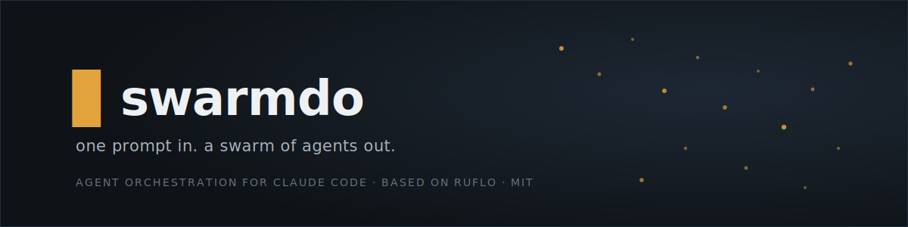

<div align="center">

[](https://swarmdo.com)

[](https://www.npmjs.com/package/swarmdo)
[](https://github.com/JannieP/swarmdo/blob/main/LICENSE)
[](https://swarmdo.com)

*Based on the original, hugely popular **ruflo** — renamed, self-contained, and MIT-licensed. Full lineage in [NOTICE](NOTICE).*
[](the upstream project (see NOTICE))

# Swarmdo

**Multi-agent AI harness for Claude Code and Codex**

</div>

Orchestrate 100+ specialized AI agents across machines, teams, and trust boundaries. Swarmdo adds coordinated swarms, self-learning memory, federated comms, and enterprise security to Claude Code — so agents don't just run, they collaborate.

### Why Swarmdo?

> Swarmdo is now Swarmdo — named by [`the upstream author`](https://swarmdo.com), who loves Rust, flow states, and building things that feel inevitable. The "Ru" is the the upstream author. The "flo" is working until 3am. Underneath, powered by [`Cognitum.One`](https://cognitum.one/?Swarmdo) agentic architecture, running a supercharged Rust based AI engine, embeddings, memory, and plugin system.


### What Swarmdo Does

One `npx swarmdo init` gives Claude Code a nervous system: agents self-organize into swarms, learn from every task, remember across sessions, and — with federation — securely talk to agents on other machines without leaking data. You keep writing code. Swarmdo handles the coordination.

```
Self-Learning / Self-Optimizing Agent Architecture

User --> Swarmdo (CLI/MCP) --> Router --> Swarm --> Agents --> Memory --> LLM Providers
                          ^                           |
                          +---- Learning Loop <-------+
```

> **New to Swarmdo?** You don't need to learn 314 MCP tools or 26 CLI commands. After `init`, just use Claude Code normally -- the hooks system automatically routes tasks, learns from successful patterns, and coordinates agents in the background.

---


## Quick Start

There are **two different install paths** with very different surface areas. Pick based on what you need (#1744):

| | **Claude Code Plugin** | **CLI install (`npx swarmdo init`)** |
|---|---|---|
| What it gives you | Slash commands + a few skills + agent definitions per-plugin | Full Swarmdo loop — 98 agents, 60+ commands, 30 skills, MCP server, hooks, daemon |
| Files in your workspace | **Zero** | `.claude/`, `.swarmdo/`, `CLAUDE.md`, helpers, settings |
| MCP server registered | **No** (`memory_store`, `swarm_init`, etc. unavailable to Claude) | Yes |
| Hooks installed | No | Yes |
| Best for | Try a single plugin's commands without committing to the full install | Production use — everything works as documented |

### Path A — Claude Code Plugins (lite, slash commands only)

```bash
# Add the marketplace
/plugin marketplace add upstream/swarmdo

# Install core + any plugins you need
/plugin install swarmdo-core@swarmdo
/plugin install swarmdo-swarm@swarmdo
/plugin install swarmdo-rag-memory@swarmdo
/plugin install swarmdo-neural-trader@swarmdo
```

This adds slash commands and agent definitions only. The Swarmdo MCP server is NOT registered, so `memory_store`, `swarm_init`, `agent_spawn`, etc. won't be callable from Claude. For the full loop, use Path B below.

<details>
<summary><strong>🔌 All 34 plugins</strong></summary>

#### Core & Orchestration

| Plugin | What it does |
|--------|-------------|
| [**swarmdo-core**](plugins/swarmdo-core/README.md) | Foundation — server, health checks, plugin discovery |
| [**swarmdo-swarm**](plugins/swarmdo-swarm/README.md) | Coordinate multiple agents as a team |
| [**swarmdo-autopilot**](plugins/swarmdo-autopilot/README.md) | Let agents run autonomously in a loop |
| [**swarmdo-loop-workers**](plugins/swarmdo-loop-workers/README.md) | Schedule background tasks on a timer |
| [**swarmdo-workflows**](plugins/swarmdo-workflows/README.md) | Reusable multi-step task templates |
| [**swarmdo-federation**](plugins/swarmdo-federation/README.md) | Agents on different machines collaborate securely |

#### Memory & Knowledge

| Plugin | What it does |
|--------|-------------|
| [**swarmdo-agentdb**](plugins/swarmdo-agentdb/README.md) | Fast vector database for agent memory |
| [**swarmdo-rag-memory**](plugins/swarmdo-rag-memory/README.md) | Smart retrieval — hybrid search, graph hops, diversity ranking |
| [**swarmdo-rvf**](plugins/swarmdo-rvf/README.md) | Save and restore agent memory across sessions |
| [**swarmdo-swarmvector**](plugins/swarmdo-swarmvector/README.md) | [`swarmvector`](https://npmjs.com/package/swarmvector) — GPU-accelerated search, Graph RAG, 103 tools |
| [**swarmdo-knowledge-graph**](plugins/swarmdo-knowledge-graph/README.md) | Build and traverse entity relationship maps |

#### Intelligence & Learning

| Plugin | What it does |
|--------|-------------|
| [**swarmdo-intelligence**](plugins/swarmdo-intelligence/README.md) | Agents learn from past successes and get smarter |
| [**swarmdo-graph-intelligence**](plugins/swarmdo-graph-intelligence/) | Sublinear graph reasoning — PageRank, delta updates, complexity-aware execution (ADR-123) |
| [**swarmdo-daa**](plugins/swarmdo-daa/README.md) | Dynamic agent behavior and cognitive patterns |
| [**swarmdo-swarmllm**](plugins/swarmdo-swarmllm/README.md) | Run local LLMs (Ollama, etc.) with smart routing |
| [**swarmdo-goals**](plugins/swarmdo-goals/README.md) | Break big goals into plans and track progress |

#### Code Quality & Testing

| Plugin | What it does |
|--------|-------------|
| [**swarmdo-testgen**](plugins/swarmdo-testgen/README.md) | Find missing tests and generate them automatically |
| [**swarmdo-browser**](plugins/swarmdo-browser/README.md) | Automate browser testing with Playwright |
| [**swarmdo-jujutsu**](plugins/swarmdo-jujutsu/README.md) | Analyze git diffs, score risk, suggest reviewers |
| [**swarmdo-docs**](plugins/swarmdo-docs/README.md) | Generate and maintain documentation automatically |

#### Security & Compliance

| Plugin | What it does |
|--------|-------------|
| [**swarmdo-security-audit**](plugins/swarmdo-security-audit/README.md) | Scan for vulnerabilities and CVEs |
| [**swarmdo-aidefence**](plugins/swarmdo-aidefence/README.md) | Block prompt injection, detect PII, safety scanning |

#### Architecture & Methodology

| Plugin | What it does |
|--------|-------------|
| [**swarmdo-adr**](plugins/swarmdo-adr/README.md) | Track architecture decisions with a living record |
| [**swarmdo-ddd**](plugins/swarmdo-ddd/README.md) | Scaffold domain-driven design — contexts, aggregates, events |
| [**swarmdo-sparc**](plugins/swarmdo-sparc/README.md) | Guided 5-phase development methodology with quality gates |
| [**swarmdo-metaharness**](the upstream project (see NOTICE)) | Grade your agent setup, scan tool configs for security risks, and track changes over time ([guide](the upstream project (see NOTICE))) |

#### DevOps & Observability

| Plugin | What it does |
|--------|-------------|
| [**swarmdo-migrations**](plugins/swarmdo-migrations/README.md) | Manage database schema changes safely |
| [**swarmdo-observability**](plugins/swarmdo-observability/README.md) | Structured logs, traces, and metrics in one place |
| [**swarmdo-cost-tracker**](plugins/swarmdo-cost-tracker/README.md) | Track token usage, set budgets, get cost alerts |

#### Extensibility

| Plugin | What it does |
|--------|-------------|
| [**swarmdo-agent**](plugins/swarmdo-agent/README.md) | Run agents — local WASM sandbox (rvagent) + Anthropic Claude Managed Agents (cloud) |
| [**swarmdo-plugin-creator**](plugins/swarmdo-plugin-creator/README.md) | Scaffold, validate, and publish your own plugins |

#### Domain-Specific

| Plugin | What it does |
|--------|-------------|
| [**swarmdo-iot-cognitum**](plugins/swarmdo-iot-cognitum/README.md) | IoT device management — trust scoring, anomaly detection, fleets |
| [**swarmdo-neural-trader**](plugins/swarmdo-neural-trader/README.md) | [`neural-trader`](https://npmjs.com/package/neural-trader) — AI trading with 4 agents, backtesting, 112+ tools |
| [**swarmdo-market-data**](plugins/swarmdo-market-data/README.md) | Ingest market data, vectorize OHLCV, detect patterns |

</details>

### CLI Install

**macOS / Linux / WSL / Git-Bash:**

```bash
# One-line install (POSIX shells only — see Windows note below)
curl -fsSL https://cdn.jsdelivr.net/gh/upstream/swarmdo@main/scripts/install.sh | bash
```

**All platforms (including native Windows PowerShell / cmd):**

```bash
# Interactive setup wizard — runs identically on every platform
npx swarmdo@latest init wizard

# Quick non-interactive init
# npx swarmdo@latest init

# Or install globally
npm install -g swarmdo@latest
```

> 💡 **Windows users:** the `curl ... | bash` form needs a POSIX shell (Git-Bash, WSL, MSYS). The `npx swarmdo@latest init wizard` line works natively in PowerShell and cmd. If you hit an `'bash' is not recognized` error, use the `npx` line instead — both end up running the same init flow.

### MCP Server

```bash
# Add Swarmdo as an MCP server in Claude Code (canonical form, matches USERGUIDE.md)
claude mcp add swarmdo -- npx swarmdo@latest mcp start
```

---

## What You Get

| Capability | Description |
|------------|-------------|
| 🤖 **100+ Agents** | Specialized agents for coding, testing, security, docs, architecture |
| 📡 **Comms Layer** | Zero-trust federation — agents across machines/orgs discover, authenticate, and exchange work securely |
| 🐝 **Swarm Coordination** | Hierarchical, mesh, and adaptive topologies with consensus |
| 🧠 **Self-Learning** | SONA neural patterns, ReasoningBank, trajectory learning |
| 💾 **Vector Memory** | HNSW-indexed AgentDB — measured ~1.9x faster at N=20k, ~3.2x–4.7x at N=5k vs brute force (recall@10 ~0.99); ANN wins above the crossover, ties/loses at small N. See [audit](docs/reviews/intelligence-system-audit-2026-05-29.md) + [`scripts/benchmark-intelligence.mjs`](scripts/benchmark-intelligence.mjs) |
| ⚡ **Background Workers** | 12 auto-triggered workers (audit, optimize, testgaps, etc.) |
| 🧩 **Plugin Marketplace** | 33 native Claude Code plugins + 21 npm plugins |
| 🔌 **Multi-Provider** | Claude, GPT, Gemini, Cohere, Ollama with smart routing |
| 🛡️ **Security** | AIDefence, input validation, CVE remediation, path traversal prevention |
| 🌐 **Agent Federation** | Cross-installation agent collaboration with zero-trust security |
| 🔬 **MetaHarness** | Audit your AI agent setup before you ship. Grade readiness (1-100), scan tool configs for security issues, snapshot the whole project to catch regressions over time, and find templates that match your repo. `swarmdo eject` turns a swarmdo project into a standalone agent toolkit with its own name. [Full guide](the upstream project (see NOTICE)). |
| 💬 **[Web UI Beta](https://swarmdo.com)** | Multi-model chat at swarmdo.com with parallel MCP tool calling and an in-browser WASM tool gallery |
| 🎯 **[Swarmdo Research](https://swarmdo.com)** | GOAP A\* planner at swarmdo.com — plain-English goals → executable agent plans, with a live agent dashboard at [/agents](https://swarmdo.com) |

<p align="center">
  <a href="https://swarmdo.com">
    
  </a>
</p>

### Web UI (Beta) — self-hostable, hosted demo at [swarmdo.com](https://swarmdo.com)

**Swarmdo's web UI is a multi-model AI chat with built-in Model Context Protocol (MCP) tool calling.** Talk to Qwen, Claude, Gemini, or OpenAI while Swarmdo invokes the same MCP tools the CLI uses — agent orchestration, persistent memory, swarm coordination, code review, GitHub ops — directly from chat. No install, no API key needed to try it.

| | What it is | Why it matters |
|---|------------|----------------|
| 🧠 | **Any model, local or remote** | 6 curated frontier models out-of-the-box — Qwen 3.6 Max (default), Claude Sonnet 4.6, Claude Haiku 4.5, Gemini 2.5 Pro, Gemini 2.5 Flash, OpenAI — via OpenRouter. Add your own: any OpenAI-compatible endpoint (vLLM, Ollama, LM Studio, Together, Groq, self-hosted). |
| 🦾 | **swarmLLM self-learning AI** | Native support for [swarmLLM](the upstream project (see NOTICE)) (lives in `upstream/SwarmVector/examples/swarmLLM`) — Swarmdo's self-improving local model layer. Routes to MicroLoRA adapters, learns from your trajectories via SONA, and stays on your machine. Pair with the cloud models or run fully offline. |
| 🛠️ | **~210 tools, ready to call** | 5 server groups (Core, Intelligence, Agents, Memory, DevTools) plus an 18-tool gallery that runs entirely in your browser — works offline. |
| 🔌 | **Bring your own MCP servers** | Click the **MCP (n)** pill in the chat input → *Add Server* and paste any MCP endpoint (HTTP, SSE, or stdio). Your tools join Swarmdo's native ones in the same parallel-execution flow. Run a local MCP server on `localhost:3000` and it just works. |
| ⚡ | **Tools run in parallel** | One model response can fire 4–6+ tools at the same time. The UI shows them as cards with a *Step 1 — 2 tools completed* badge so you can see exactly what ran. |
| 💾 | **Memory that sticks** | Say *"remember my favorite color is indigo"* and ask weeks later — Swarmdo recalls it. Backed by AgentDB + HNSW vector search (measured ~1.9x–4.7x faster than brute force above the crossover, recall@10 ~0.99). |
| 📘 | **Built-in capabilities tour** | Click the question-mark icon in the sidebar — a "Swarmdo Capabilities" modal opens with the full tool list, model strengths, architecture, and keyboard shortcuts. |
| 🏠 | **Self-hostable** | Web UI is shipped as Docker (`swarmdo/src/swarmvocal/Dockerfile`) with embedded Mongo. Deploy to your own Cloud Run / Fly / Kubernetes / docker-compose. The hosted [swarmdo.com](https://swarmdo.com) demo is one option; running your own is fully supported. |
| 🚀 | **Zero install to try** | Open the hosted URL, pick a model, type a question. That's the whole onboarding. |

**Try the hosted demo:** [https://swarmdo.com](https://swarmdo.com) — no account, no API key. **Run your own:** the source lives in [`swarmdo/src/swarmvocal/`](swarmdo/src/swarmvocal/) with a multi-stage Dockerfile (`INCLUDE_DB=true` builds in MongoDB) and a `cloudbuild.yaml` for Google Cloud Run. See [ADR-033](swarmdo/docs/adr/ADR-033-SWARMVOCAL-WASM-MCP-INTEGRATION.md) for the architecture and [issue #1689](the upstream project (see NOTICE)) for the roadmap.

<p align="center">
  <a href="https://swarmdo.com">
    
  </a>
</p>

### Goal Planner UI — autonomous agents at [swarmdo.com](https://swarmdo.com)

**Turn high-level goals into executable agent plans.** `swarmdo.com` is Swarmdo's hosted Goal-Oriented Action Planning (GOAP) front-end — describe an outcome in plain English and watch Swarmdo decompose it into preconditions, actions, and an A* path through state space, then dispatch the work to live agents at [`/agents`](https://swarmdo.com).

| | What it is | Why it matters |
|---|------------|----------------|
| 🎯 | **Plain-English goals** | Type *"ship the auth refactor with tests and a PR"* — Swarmdo extracts the success criteria, the constraints, and the implicit preconditions. No JSON, no DSL. |
| 🧭 | **GOAP A\* planner** | Classic gaming-AI planning ported to software work: state-space search through actions with preconditions/effects to find the shortest viable path. Replans on the fly when state changes. |
| 🤖 | **Live agent dashboard** | [swarmdo.com/agents](https://swarmdo.com) shows every spawned agent — role, current step, memory namespace, token budget, status. Click in to inspect trajectories, kill runaway workers, or reassign. |
| 🌳 | **Visual plan tree** | Goals render as collapsible action trees with progress, blocked branches, and rollbacks highlighted. See *exactly* why an agent picked a path — no opaque chain-of-thought. |
| ♻️ | **Adaptive replanning** | When an action fails or new info arrives, the planner re-runs A\* from the current state instead of restarting. Failures become learning, not loops. |
| 🧠 | **Shared memory + SONA** | Plans, trajectories, and outcomes flow into AgentDB. Future plans retrieve past solutions via HNSW — the planner gets smarter with every run. |
| 🔗 | **Wired to MCP tools** | Every action node maps to a tool call (Swarmdo's ~210 MCP tools, your custom servers, or shell). The planner schedules them in parallel where the dependency graph allows. |
| 🚀 | **Zero install to try** | Open [swarmdo.com](https://swarmdo.com), describe a goal, watch it run. Source lives in [`v3/goal_ui/`](v3/goal_ui/) — Vite + Supabase, self-hostable. |

**Try it:** [https://swarmdo.com](https://swarmdo.com) for goals · [https://swarmdo.com](https://swarmdo.com) for live agents. **Run your own:** clone the `goal` branch and `cd v3/goal_ui && npm install && npm run dev`.

### Agent Federation — Slack for Agents

```
Your Agent --> [ Remove secrets ] --> [ Sign message ] --> [ Encrypted channel ]
                 Emails, SSNs,        Proves it came       No one reads it
                 keys stripped         from you              in transit
                                                                |
                                                                v
Their Agent <-- [ Block attacks ] <-- [ Check identity ] <------+
                 Stops prompt          Rejects forgeries
                 injection

                          Audit trail on both sides.
                  Trust builds over time. Bad behavior = instant downgrade.
```

Slack gave teams channels. Federation gives agents the same thing — **shared workspaces across trust boundaries**, where agents on different machines, orgs, or cloud regions can discover each other, prove who they are, and collaborate on tasks.

The difference: some channels are trusted, some aren't. [`@swarmdo/plugin-agent-federation`](the upstream project (see NOTICE)) handles that automatically. Your agents join a federation, get verified via mTLS + ed25519, and start exchanging work — with PII stripped before anything leaves your node and every message auditable. Untrusted agents can still participate at lower privilege: they see discovery info, not your memory. As they prove reliable, trust upgrades. If they misbehave, they get downgraded instantly — no human in the loop required.

You don't configure handshakes or manage certificates. You `federation init`, `federation join`, and your agents start talking. The protocol handles identity, the PII pipeline handles data safety, and the audit trail handles compliance.

> **📘 Full user guide:** [`docs/federation/`](./docs/federation/) — setup, MCP tools, trust levels, circuit breaker, and the (opt-in) WireGuard mesh layer that ties packet-layer reachability to federation trust. ADR-111 deep-dive at [`docs/federation/phase7-mesh-bringup.md`](./docs/federation/phase7-mesh-bringup.md).

<details>
<summary><strong>Federation capabilities</strong></summary>

| | Capability | How it works |
|---|---|---|
| 🔒 | **Zero-trust federation** | Remote agents start untrusted. Identity proven via mTLS + ed25519 challenge-response. No API keys, no shared secrets. |
| 🛡️ | **PII-gated data flow** | 14-type detection pipeline scans every outbound message. Per-trust-level policies: BLOCK, REDACT, HASH, or PASS. Adaptive calibration reduces false positives. |
| 📊 | **Behavioral trust scoring** | Formula (`0.4×success + 0.2×uptime + 0.2×threat + 0.2×integrity`) continuously evaluates peers. Upgrades require history; downgrades are instant. |
| 📋 | **Compliance built-in** | HIPAA, SOC2, GDPR audit trails as compliance modes. Every federation event produces a structured record searchable via HNSW. |
| 🤝 | **9 MCP tools + 10 CLI commands** | Full lifecycle: `federation_init`, `federation_send`, `federation_trust`, `federation_audit`, and more. |

</details>

<details>
<summary><strong>Example: two teams sharing fraud signals without sharing customer data</strong></summary>

```bash
# Team A: initialize federation and generate keypair
npx swarmdo@latest federation init

# Team A: join Team B's federation endpoint
npx swarmdo@latest federation join wss://team-b.example.com:8443

# Team A: send a task — PII is stripped automatically before it leaves
npx swarmdo@latest federation send --to team-b --type task-request \
  --message "Analyze transaction patterns for account anomalies"

# Team A: check peer trust levels and session health
npx swarmdo@latest federation status
```

</details>

See [issue #1669](the upstream project (see NOTICE)) for the complete architecture, trust model, and implementation roadmap.

```bash
# Claude Code plugin
/plugin install swarmdo-federation@swarmdo

# Or via CLI
npx swarmdo@latest plugins install @swarmdo/plugin-agent-federation
```

<details>
<summary><strong>Claude Code: With vs Without Swarmdo</strong></summary>

| Capability | Claude Code Alone | + Swarmdo |
|------------|-------------------|---------|
| Agent Collaboration | Isolated, no shared context | Swarms with shared memory and consensus |
| Coordination | Manual orchestration | Queen-led hierarchy (Raft, Byzantine, Gossip) |
| Memory | Session-only | HNSW vector memory with sub-ms retrieval |
| Learning | Static behavior | SONA self-learning with pattern matching |
| Task Routing | You decide | Intelligent routing (89% accuracy) |
| Background Workers | None | 12 auto-triggered workers |
| LLM Providers | Anthropic only | 5 providers with failover |
| Security | Standard | CVE-hardened with AIDefence |

</details>

<details>
<summary><strong>Architecture overview</strong></summary>

```
User --> Claude Code / CLI
          |
          v
    Orchestration Layer
    (MCP Server, Router, 27 Hooks)
          |
          v
    Swarm Coordination
    (Queen, Topology, Consensus)
          |
          v
    100+ Specialized Agents
    (coder, tester, reviewer, architect, security...)
          |
          v
    Memory & Learning
    (AgentDB, HNSW, SONA, ReasoningBank)
          |
          v
    LLM Providers
    (Claude, GPT, Gemini, Cohere, Ollama)
```

</details>

---

## Documentation

Four docs for four audiences:

| Doc | When to read it |
|-----|-----------------|
| **[Status](docs/STATUS.md)** | See what currently works — capability counts, test baselines, recent fixes, what's next. The *is-it-ready* doc. |
| **[User Guide](docs/USERGUIDE.md)** | Daily reference — every command, every config flag, every plugin. The *how-do-I* doc. |
| **[MetaHarness Guide](the upstream project (see NOTICE))** | How to grade your agent setup, scan tool configs for security, detect changes between runs, and eject a project into a standalone agent toolkit. The *audit-my-setup* doc. |
| **[Benchmarks](https://gist.the upstream project (see NOTICE))** | v3.8.0 SOTA matrix vs LangGraph / AutoGen / CrewAI on darwin-arm64 + linux-x64. swarmdo wins cold start, single turn, RSS by 1.3×–1953×. The *is-it-fast* doc. |
| **[Verification](verification.md)** | Cryptographically prove your installed bytes match the signed witness — `swarmdo verify`. The *trust-but-verify* doc. |
| **[Team Gateway Checklist](docs/TEAM-GATEWAY-CHECKLIST.md)** | Before-merge gates, dual-mode handoff, memory namespace sharing, and witness manifest entry per merge. The *safer-team-workflows* doc. |

Benchmark internals (for reproduction): [`sota-workload-spec.md`](the upstream project (see NOTICE)) · [`SOTA-PROGRESS.md`](the upstream project (see NOTICE)) · [raw matrix JSON: darwin](the upstream project (see NOTICE)) · [linux](the upstream project (see NOTICE))

User Guide section index:

| Section | Topics |
|---------|--------|
| [Quick Start](docs/USERGUIDE.md#quick-start) | Installation, prerequisites, install profiles |
| [Core Features](docs/USERGUIDE.md#-core-features) | MCP tools, agents, memory, neural learning |
| [Intelligence & Learning](docs/USERGUIDE.md#-intelligence--learning) | Hooks, workers, SONA, model routing |
| [Swarm & Coordination](docs/USERGUIDE.md#-swarm--coordination) | Topologies, consensus, hive mind |
| [Security](docs/USERGUIDE.md#%EF%B8%8F-security) | AIDefence, CVE remediation, validation |
| [Ecosystem](docs/USERGUIDE.md#-ecosystem--integrations) | SwarmVector, agentic-flow, Flow Nexus |
| [Configuration](docs/USERGUIDE.md#%EF%B8%8F-configuration--reference) | Environment variables, config schema |
| [Plugin Marketplace](https://upstream.github.io/swarmdo) | Browse and install plugins |

---

## Support

| Resource | Link |
|----------|------|
| Documentation | [User Guide](docs/USERGUIDE.md) |
| Issues & Bugs | [GitHub Issues](the upstream project (see NOTICE)) |
| Enterprise | [swarmdo.com](https://swarmdo.com) |
| Community | [Agentics Foundation Discord](https://discord.com/invite/dfxmpwkG2D) |
| Powered by | [Cognitum.one](https://cognitum.one) |

## License

MIT - [the upstream author](https://the upstream project (see NOTICE))
